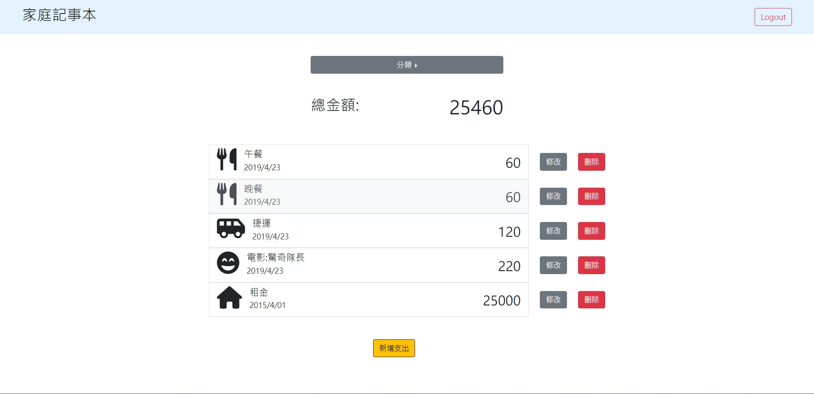
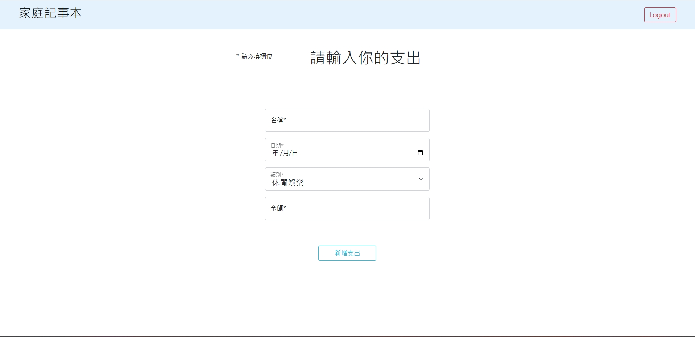
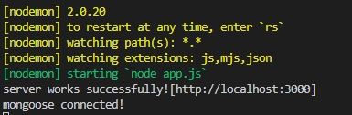

# 餐廳清單


## 規格:
+ 程式編輯器: [Visual Studio Code](https://visualstudio.microsoft.com/zh-hant/ "Visual Studio Code") 
+ 使用框架: [express](https://www.npmjs.com/package/express)@4.16.4
+ 模板引擎: [express-handlebars](https://www.npmjs.com/package/express-handlebars)@3.0.0
+ [bcryptjs](https://www.npmjs.com/package/bcryptjs)@2.4.3
+ [connect-flash](https://www.npmjs.com/package/connect-flash)@0.1.1
+ [dotenv](https://www.npmjs.com/package/dotenv)@16.0.3
+ [express-session](https://www.npmjs.com/package/express-session)@1.17.3
+ [method-override](https://www.npmjs.com/package/method-override)@3.0.0
+ [mongoose](https://www.npmjs.com/package/mongoose)@5.9.7
+ [passport](https://www.npmjs.com/package/passport)@0.6.0
+ [passport-local](https://www.npmjs.com/package/passport-local)@1.0.0
---
## 功能:
+ 使用者可以註冊帳號，資料包刮email、密碼、確認密碼
+ 使用者必須登入才可使用記帳本
+ 使用者可以在首頁看到支出紀錄的
  - 類別
  - 支出名
  - 金額
  - 日期
  - 總金額

+ 使用者可以用類別來過濾支出紀錄
+ 使用者可以用名字、日期、類別來排序支出紀錄
+ 使用者可以新增支出
+ 使用者可以刪除支出
+ 使用者可以編輯支出
---
## 安裝與執行:
1. clone此專案
```
git clone https://github.com/sd880428/expense-tracker.git
```

2. 使用終端機到此專案目錄下
```
cd ~/.../expense-tracker/
```
3. 安裝套件
```
npm i
```
4. 自行加入.env 檔

5. 執行
```
npm run dev
```
如成功終端機會顯示:


6. 開啟瀏覽器進入 http://localhost:3000 即可

